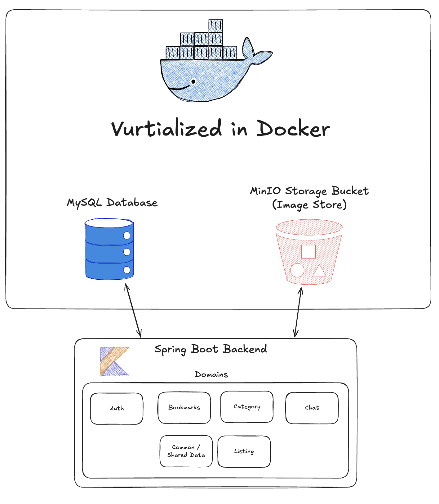
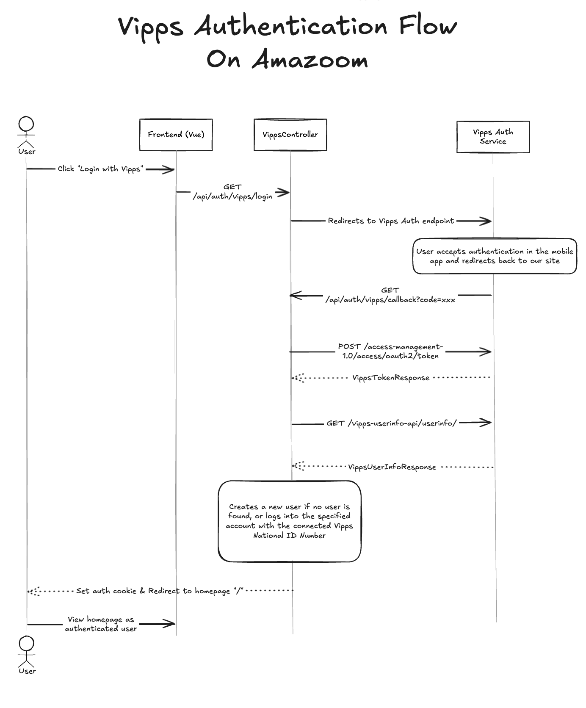
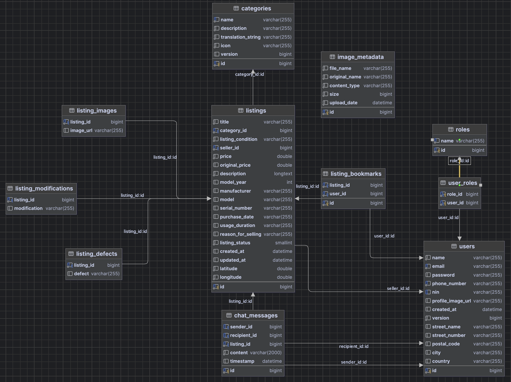

# Amazoom Prosjektdokumentasjon

## Oversikt

Amazoom er en handelsmarked inspirert av Finn.no bygget med moderne utviklingspraksis og sikre arkitekturprinsipper. Applikasjonen følger en domenedrevet designtilnærming for å sikre vedlikeholdbarhet, skalerbarhet og tydelig separasjon av ansvarsområder. Dette dokumentet skisserer den tekniske arkitekturen og designbeslutningene implementert i dette prosjektet.



## Prosjektstruktur

Prosjektet består av to hovedkomponenter:

1. **Backend**: En Spring Boot-applikasjon skrevet i Kotlin som følger domenedrevne designprinsipper
2. **Frontend**: En Vue.js-applikasjon med TypeScript til brukergrensesnittet

### Backend-struktur

Backend følger en domenedrevet design (DDD)-tilnærming med en tydelig separasjon mellom forskjellige domener. Hvert domene er inneholdt i sin egen pakke med dedikerte entiteter, repositories, tjenester og kontrollere. Denne strukturen bidrar til å opprettholde domenegrenser og forhindrer upassende CORS forespørsler.

```
src/main/kotlin/edu/ntnu/fullstack/amazoom/
├── auth/                  # Autentisering og autorisasjonsdomene
│   ├── config/            # Sikkerhetskonfigurasjon
│   ├── controller/        # Auth-endepunkter
│   ├── dto/               # Dataoverføringsobjekter
│   ├── filter/            # Sikkerhetsfiltre (JWT)
│   ├── service/           # Auth-tjenester
├── bookmark/              # Bokmerkedomene
├── category/              # Kategoridomene
├── chat/                  # Chat-domene
├── common/                # Delte komponenter
│   ├── config/            # Applikasjonskonfigurasjon
│   ├── controller/        # Vanlige kontrollere
│   ├── dto/               # Delte DTOer
│   ├── entity/            # Vanlige entiteter (Bruker, Rolle)
│   ├── exception/         # Unntakshåndtering
│   ├── repository/        # Vanlige repositories
│   ├── service/           # Delte tjenester
├── config/                # Global konfigurasjon
├── listing/               # Produktlistingsdomene
```

### Frontend-struktur

Frontend er organisert som en Vue.js-applikasjon med TypeScript-støtte, som bruker Pinia til "Global state management" og Vue Router for navigasjon.

```
frontend/
├── src/
│   ├── assets/            # Statiske ressurser og global styling
│   ├── components/        # Gjenbrukbare UI-komponenter
│   ├── i18n/              # Internasjonalisering
│   ├── lib/               # Utilityfunksjoner
│   ├── router/            # Rutedefinisjoner
│   ├── stores/            # Pinia stores
│   ├── views/             # Sidekomponenter
```

## Implementasjon av domenedrevet design

### Avgrensede kontekster

Applikasjonen er strukturert rundt følgende avgrensede kontekster:

1. **Autentisering og autorisasjon**: Brukerautentisering, registrering og tilgangsstyring
2. **Annonser**: Produktannonser, søking, filtrering
3. **Kategorier**: Produktkategorisering
4. **Bokmerker**: Brukerne sine lagrede annonser
5. **Chat**: Kommunikasjon mellom kjøpere og selgere

Hver avgrenset kontekst har sine egne:

-   **Entiteter**: Domeneobjekter med identitet
-   **Verdiobjekter**: Uforanderlige objekter uten identitet
-   **Repositories**: Datatilgangskomponenter
-   **Tjenester**: Implementasjoner av forretningslogikk
-   **DTOer**: Dataoverføringsobjekter for API-kommunikasjon

### Eksempel: Annonsedomenet

Annonsedomenet demonstrerer hvordan DDD er implementert:

-   **Entitet**: `Listing` representerer en produktannonse med egenskaper som tittel, beskrivelse, pris
-   **Repository**: `ListingRepository` håndterer datapersistens
-   **Tjenester**: Kapsler forretningslogikk for å opprette, oppdatere, søke i annonser
-   **Kontrollere**: REST API-endepunkter for å få tilgang til og manipulere annonser

Denne strukturen holder alle annonserelaterte anliggender sammen, i tråd med prinsippet om enkeltstående ansvarsfordeling.

## OWASP-sikkerhetsimplementasjon

Applikasjonen følger OWASP best practices for å beskytte mot vanlige sikkerhetssårbarheter:

### Autentisering og autorisasjon

1. **JWT-basert autentisering**:

    - Tilstandsløs autentisering ved hjelp av JSON Web Tokens
    - Tokens valideres ved hver forespørsel gjennom `JwtAuthFilter`
    - Korte levetider for tilgangstokener for å minimere risiko hvis de blir kompromittert

2. **Passord-sikkerhet**:

    - Passord lagres ved hjelp av BCrypt-hashing (se `SecurityConfig` der `BCryptPasswordEncoder` er konfigurert)
    - Støtte for multifaktor-autentisering gjennom Vipps-integrasjon

3. **Rollebasert tilgangskontroll**:
    - Brukere har spesifikke roller (ROLE_USER, ROLE_ADMIN)
    - Endepunkter er sikret basert på rollekrav
    - Metode-nivå sikkerhet med `@PreAuthorize`-annotasjoner

### API-sikkerhet

1. **Inndatavalidering**:

    - Valideringer av forespørsler ved hjelp av Jakarta-valideringsannotasjoner
    - DTO-mønsteret sikrer at kun validerte data kommer inn i systemet

2. **CORS-konfigurasjon**:
    - Siden backend "hoster" frontenden statisk i produksjon, er de fleste forespørsler SameOrigin og ikke underlagt CORS
    - For utvikling har vi strenge CORS-regler som bare tillater forespørsler fra Vite utviklingsserveren
    - API-et spesifiserer tillatte metoder, headere og autentiserting nøye

## Autentiseringsflyt

### Standard autentiseringsflyt

1. Bruker sender legitimasjon (e-post/passord) til `/api/auth/login`
2. System validerer legitimasjonen mot lagrede (hashede) passord
3. Hvis gyldig, genereres en JWT-token og returneres
4. Påfølgende forespørsler inkluderer denne tokenen i Authorization-header
5. `JwtAuthFilter` validerer tokens på beskyttede endepunkter

### Vipps autentiseringsflyt

Vipps-integrasjon gir en sekundær autentiseringsmetode:



1. Bruker initierer Vipps-innlogging
2. Systemet omdirigerer til Vipps-autentiseringstjenesten
3. Bruker autentiserer med Vipps (via mobil)
4. Vipps omdirigerer tilbake med autorisasjonskode
5. System utveksler kode for Vipps brukerinformasjon
6. Bruker er autentisert og JWT-token utstedes

## Databasedesign

Applikasjonen bruker MySQL som relasjonsdatabase med følgende nøkkelentiteter:

1. **User**: Lagrer brukerinformasjon og legitimasjon
2. **Role**: Definerer brukerroller og tillatelser
3. **Listing**: Inneholder produktannonsdetaljer
4. **Category**: Definerer produktkategorier
5. **ListingBookmark**: Brukerlagrede annonser
6. **ChatMessage**: Meldinger mellom brukere

Flyway-migreringer håndterer databaseskjemaevolusjon, og sikrer konsistent skjema på tvers av miljøer.



## API-dokumentasjon

API-et følger RESTful-prinsipper med følgende hovedendepunkter:

-   `/api/auth/*`: Autentiseringsoperasjoner
-   `/api/listings/*`: Produktannonseoperasjoner
-   `/api/categories/*`: Kategoriadministrasjon
-   `/api/users/*`: Brukerprofiladministrasjon
-   `/api/bookmarks/*`: Bokmerkeoperasjoner
-   `/api/chat/*`: Meldingsfunksjonalitet

Hvert endepunkt er dokumentert med Swagger/OpenAPI-annotasjoner for omfattende API-dokumentasjon. Vi anbefaler å bruke den moderne API-Dokumentasjonen til Scalar som man finner på endepunktet `/docs.html`, men om man ønsker swagger dokumentasjon finner man dette på endepunktet `/swagger-ui.html`

## Distribusjonsarkitektur

Systemet er designet for containerbasert distribusjon:

-   **Backend**: Spring Boot-applikasjon i en Docker-container som "hoster" frontend-ressurser statisk i produksjon
-   **Frontend**:
    -   I produksjon: Statisk bygget og "hostet" av Spring Boot-backend
    -   I utvikling: Vite-utviklingsserver med proxy til backend
-   **Database**: MySQL-database for datalagring lagring
-   **Objektlagring**: MinIO for object store og bildelagring
